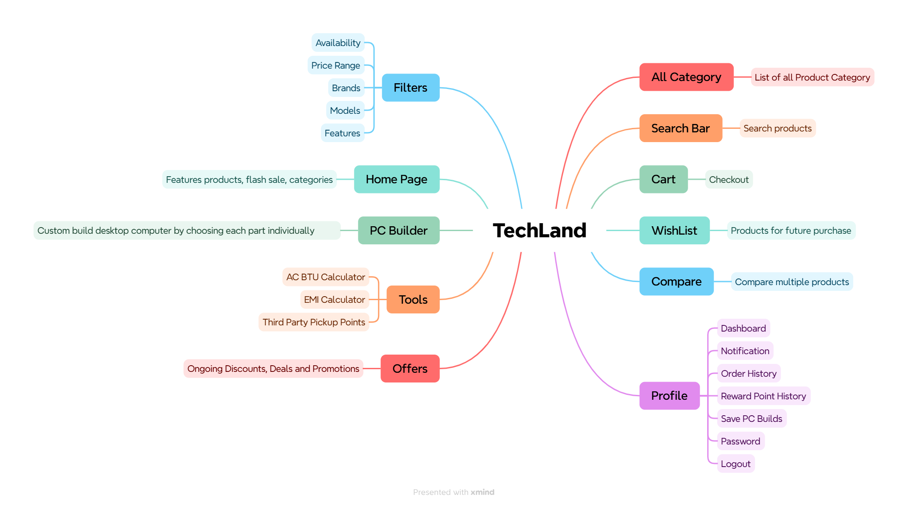
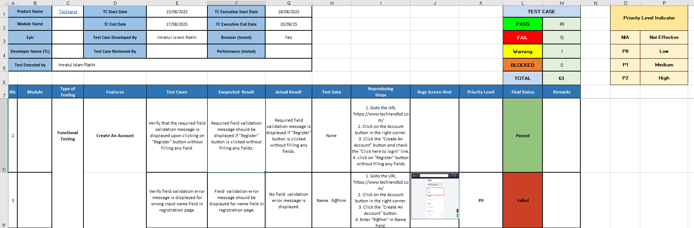
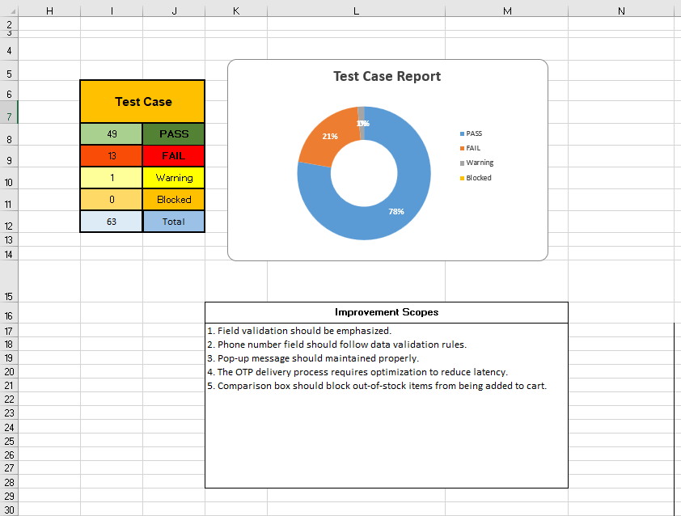
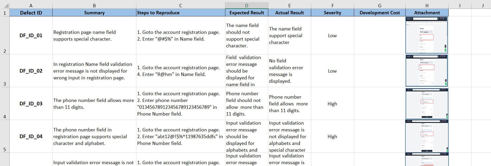

# Techland Manual Test Cases
XL Google Drive Link: https://docs.google.com/spreadsheets/d/1MYGPOTCfhhGH53bF5NQn6-fcEuIBJ2JV/edit?usp=sharing&ouid=118413631226048979273&rtpof=true&sd=true

## Project Overview:
Tech Land (https://www.techlandbd.com/) is a reputable and forward-thinking computer hardware, software, and service supplier company that was established in August 2016. Since our inception, we have consistently grown and evolved, expanding our portfolio to offer a comprehensive range of computing services, products, and solutions.

## Testing Tools:
Mind Mapping Tool: **Xmind**

Test Case Management: **Microsoft Excel** (For detailed test case creation and management) 

The excel file (Techland_.xlsx) contains detailed test cases.
## Includings: 
<< 1st Page >>

## Mind Mapping

<< 2nd Page >>

Manual Test Cases

## Manual Testing Overview

<< 3rd Page >>

Test Summary Report 

## Test Summery & Improvement Scopes

<< 4th Page >>

Bug Report

## Bug Report

